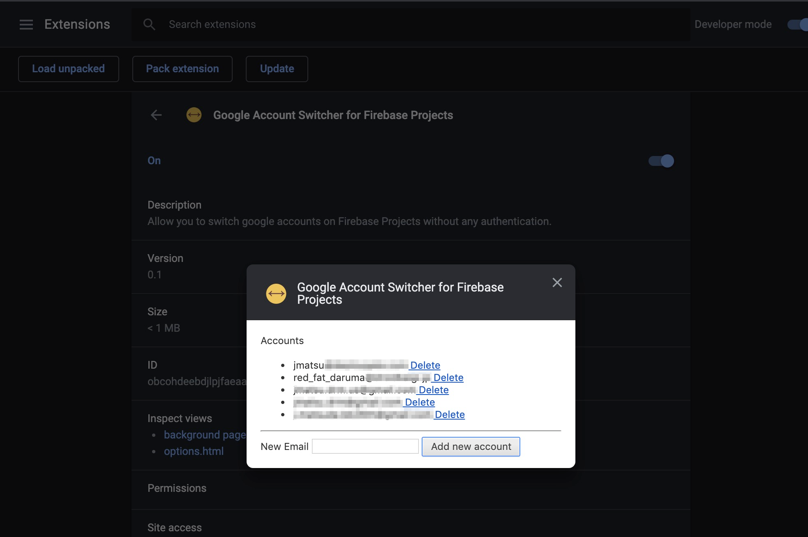

# Chrome Extension : Google Account Switcher for Firebase Projects

A Google Chrome extension allows to switch accounts without frustrations when a selected account does not have permission to see a Firebase project.

<a href="https://chrome.google.com/webstore/detail/google-account-switcher-f/ebmkkoeipcbkdcmkbkfmbadifogpdjcb" target="_blank"></a>

## Motivation

Currently, Firebase does not have a Google account switcher like other Google pages. So we need to modify the user's index in the URL of Firebase Project if `authuser-index <n>` does not have permission to see the project... it's terrible!


## How to use

- Install the extension
- Add en email of a candidate account from options page



- Open/reload a *forbidden* firebase project, then you can see account list.


- Click the account component
- Now you can see the project correctly

## Development

```
$ yarn install --frozen-version
$ yarn watch
```

And then, please load `dist` directory from your Google Chrome.

```
# Run tests
$ yarn test
```

